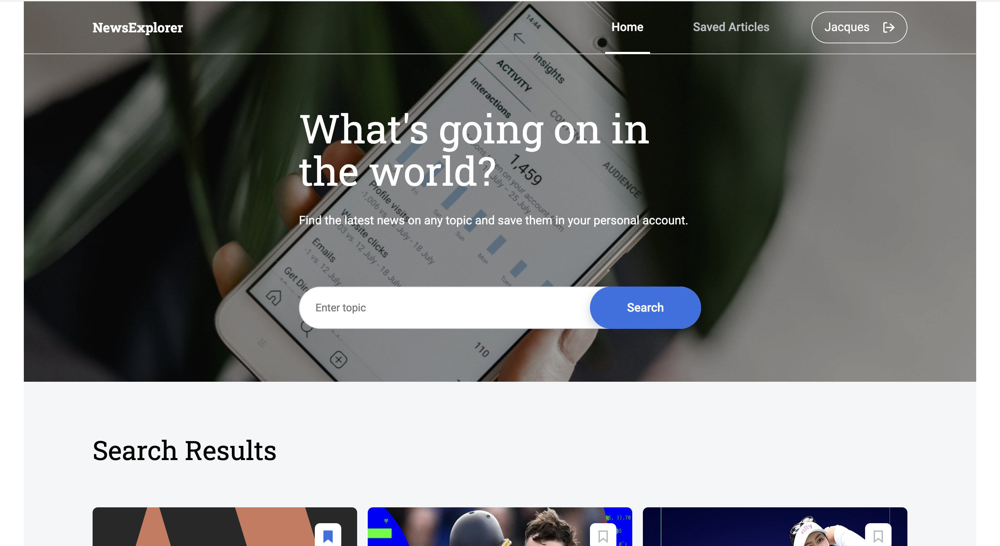
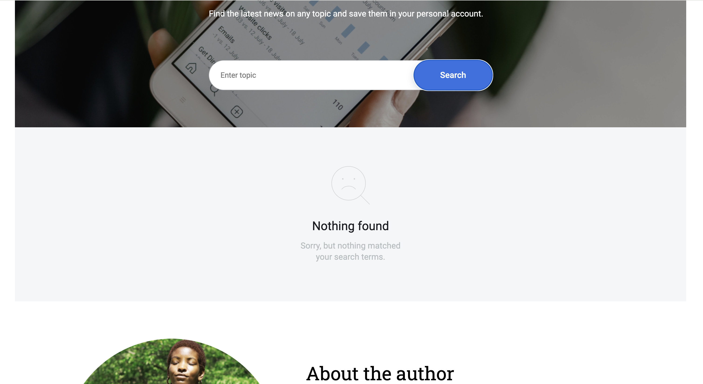
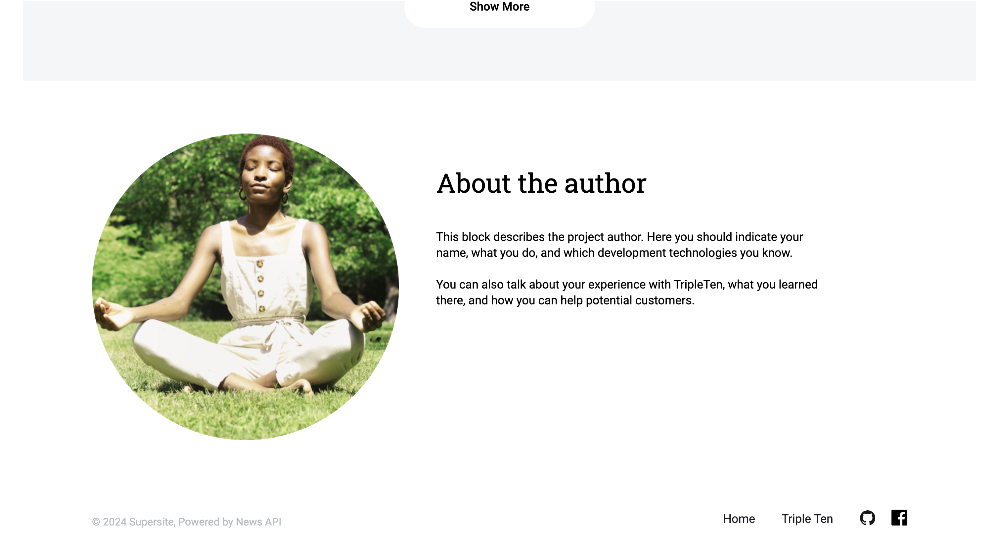
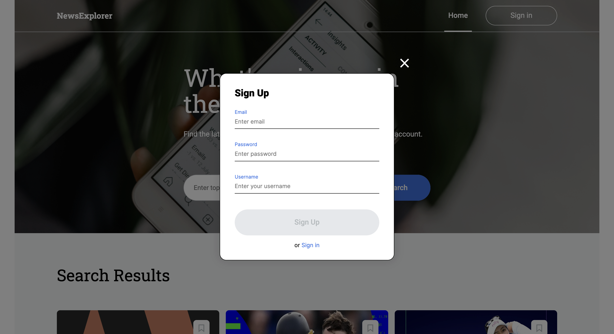
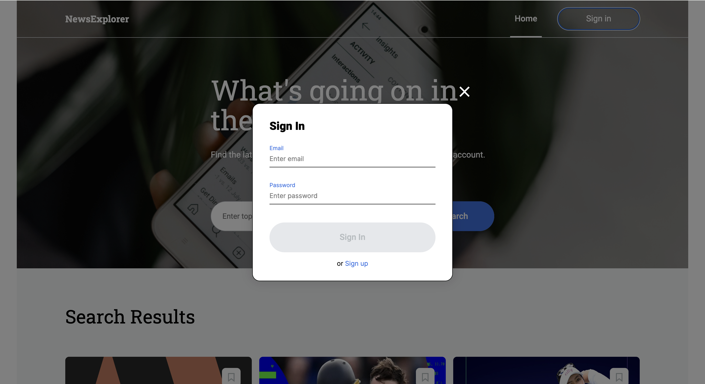
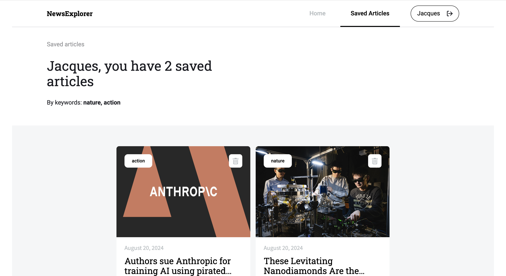
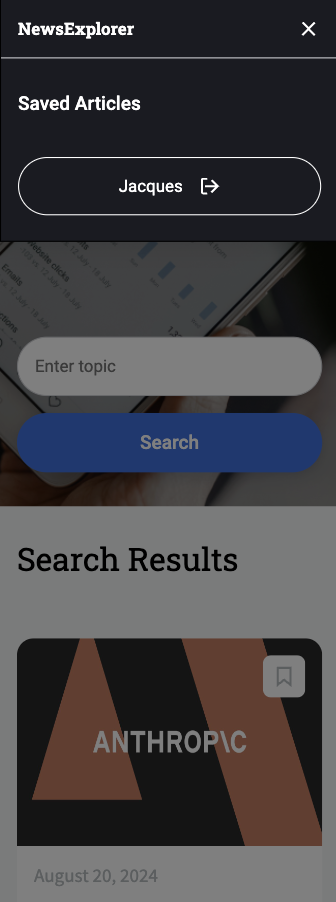
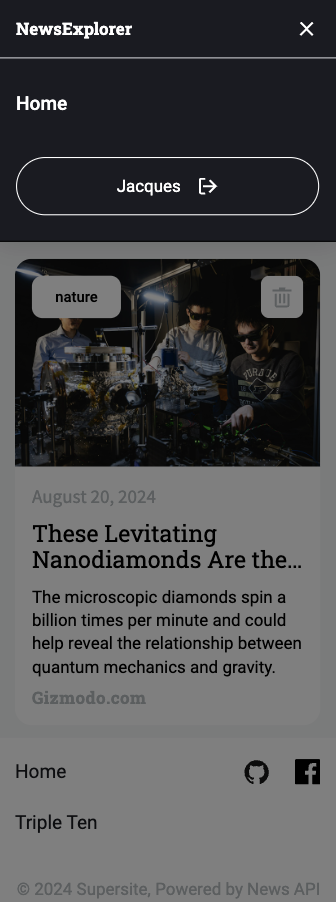

# Project Name

News Explorer (Front End)

## Description

News Expolrer is and application where users can search news articles based on keywords entered in the search field. The results of the search will generate articles that were published within 7 days prior to the search. Users can create an account and save articles. When logged in, a user has access to their saved articles on a separate page. This page displays the users saved articles. The user can delete saved articles from this page. The saved article page also displays the number of articles saved, along with a list of the keywords from the searches from which the articles were saved. The keywords are listed in descending order of popularity. Users will stay logged in for 7 days, or until they sign out. If a user leaves the page while browsing search results, the results will be the same when they return to the page unless browser data is deleted.

## Technologies and Techniques

- HTML5
- CSS
- Responsive Design
- Javascript
- JSX
- React.js
- Node.js
- React-Router
- Local Storage
- API Requests

## Backend

https://github.com/Zchabot/project-news-explorer-backend

https://api.news-explorer-zc.port0.org

## Link

https://news-explorer-zc.port0.org

## Images

